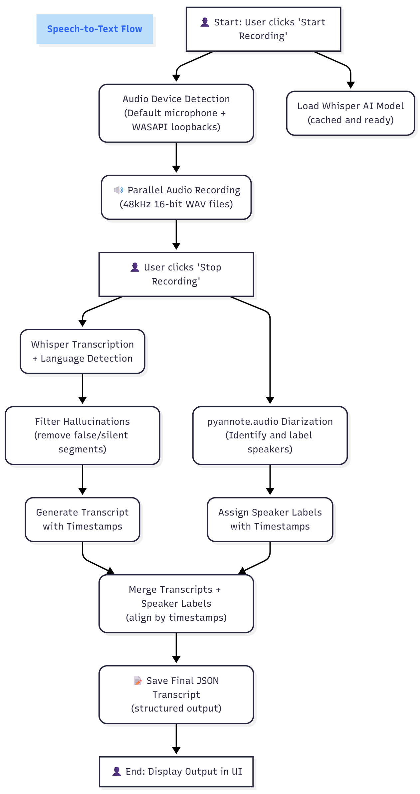

# Speech to Text POC

Meeting audio capture and transcription using OpenAI Whisper and PyAnnote for diarization.

## Features

- **System Audio Recording**: Capture audio from Teams, Zoom, Youtube, or any system audio playing on your device using WASAPI loopback
- **Microphone Recording**: Simultaneous microphone and system audio capture
- **Transcription**: Transcription from speech to text using OpenAI Whisper
- **Speaker Diarization**: Identify different speakers using pyannote.audio to view meeting transcription with timestamps and speaker labels
- **Whisper Model**: The Whisper AI model used is the base one (all model config: tiny, base, small, medium, or large)
- **Export Transcripts**: Save transcriptions as JSON files with metadata
- **Simple UI**: Built with Streamlit UI for easy use

## Quick Start
Warning: This app is only meant for Windows operating systems.

### Prerequisites

1. **Python 3.13** (recommended)
2. **Poetry** for dependency management
3. **Conda** for environment management

### Installation

```bash
# Create conda environment
conda create -n spch2txt "python=3.13"
conda activate spch2txt

# Install Poetry
pip install poetry

# Install dependencies
poetry install --no-root
```

### Configure Speaker Diarization
   
   To enable speaker identification, set up pyannote.audio:
   - Accept user conditions for pyannote models:
     - https://huggingface.co/pyannote/segmentation-3.0
     - https://huggingface.co/pyannote/speaker-diarization-3.1
   - Create a Hugging Face access token (READ only) at https://hf.co/settings/tokens
   - Create a `.env` file in the project root using `.env.example` as template then replace:
     ```
     HUGGINGFACE_TOKEN=your_token_here
     ```

```bash
poetry run streamlit run src/ui/app.py
```

### Running the Application

1. **Start the Streamlit UI**
   ```bash
   poetry run streamlit run src/ui/app.py
   ```

2. **User Mode (Default)**
   - Automatically detects default microphone and all loopback devices
   - Click "Start Recording" to begin unlimited recording
   - Click "Stop Recording" when finished
   - Transcription starts automatically after recording stops
   - View timestamped transcripts with speaker labels

3. **Dev Mode**
   - Enable "Dev Mode" in the sidebar
   - Manually select specific microphone and loopback devices
   - Set fixed recording duration
   - Useful for testing specific device configurations

## Speech to Text Workflow



### How It Works

1. **Audio Capture**
   - Captures audio from microphone and system loopback devices simultaneously
   - Uses WASAPI loopback to record system audio (Teams, Zoom, etc.)
   - Records each device to separate WAV files

2. **Transcription**
   - Loads Whisper model (cached at initiation for performance)
   - Transcribes each audio stream separately with timestamps
   - Filters out Whisper hallucinations (like false transcriptions from silence)

3. **Speaker Diarization**
   - Analyzes audio to identify different speakers
   - Assigns speaker labels to transcription segments
   - Combines diarization with transcription using timestamp overlap

4. **Output**
   - Combines transcripts from all devices in chronological order
   - Formats output with timestamps and speaker labels
   - Saves to JSON file with metadata in `src/saved_transcripts/`
   - Example output:
     ```
     [00:05] [Microphone SPEAKER_00]: Hello everyone
     [00:08] [System Audio SPEAKER_01]: Hi, thanks for joining
     ```

## Testing & Development

### Available Test Scripts

| Test Script | Purpose | Command |
|------------|---------|----------|
| `test_full_workflow.py` | Complete record + transcribe workflow | `poetry run python tests/test_full_workflow.py` |
| `test_audio_devices.py` | List all audio devices | `poetry run python tests/test_audio_devices.py` |
| `test_record.py` | Simple 10-second recording | `poetry run python tests/test_record.py` |
| `test_transcribe.py` | Transcribe existing WAV file | `poetry run python tests/test_transcribe.py` |
| `test_teams_audio.py` | Interactive Teams audio testing | `poetry run python tests/test_teams_audio.py` |

### Code Formatting
```bash
poetry run ruff check . --fix
poetry run ruff format .
```

## Whisper Model Comparison

| Model  | Size     | Speed     | Accuracy | Recommended For |
| ------ | -------- | --------- | -------- | --------------- |
| tiny   | ~39 MB   | Very Fast | Basic    | Quick tests     |
| base   | ~74 MB   | Fast      | Good     | General use     |
| small  | ~244 MB  | Medium    | Better   | Quality results |
| medium | ~769 MB  | Slow      | Great    | High accuracy   |
| large  | ~1550 MB | Very Slow | Best     | Maximum quality |

## Limitations

- ⚠️ **Windows Only** ⚠️: Uses `pyaudiowpatch` for WASAPI support
- **No Docker**: Runs directly on Windows
- **System Audio**: Captures all system audio, not isolated to specific apps
- **Permissions**: May require admin rights depending on audio device configuration

## Development Challenges

### Audio Device Detection
- Windows provides a long list of audio devices (microphones, loopback, outputs)
- Challenge: Identifying which loopback device is actually in use
- Solution: Detect all loopback devices and filter by checking for actual audio data during recording

### ASR Methodology
- Understanding different Automatic Speech Recognition approaches
- Learning Whisper's capabilities and limitations
- Balancing model size vs. accuracy vs. speed

### PyAnnote Dependencies
- Complex dependency chain with unclear documentation
- Gated models requiring Hugging Face authentication
- Solution: Implemented lazy loading to avoid conflicts

### Hallucination Filtering
- Microphone transcribes false text ("1.5%", "...", etc.) during silence
- Caused by low audio levels triggering Whisper's pattern recognition
- Solution: Filter segments based on `no_speech_prob` threshold and known hallucination patterns
- Example filtered output:
  ```
  ⚠ Filtered: '1.5%' (no_speech_prob=0.58)
  ⚠ Filtered 14 hallucination(s)
  ✓ Kept 0 valid segment(s)
  ```

### Combining Transcription and Diarization
- Challenge: Merging speaker labels from diarization with text from transcription
- Both systems produce time-based segments with different boundaries
- Solution: Match segments using timestamp interval overlap, assigning speakers based on maximum overlap duration

### Audio Corruption when adding Diarization
- Initial implementation caused corrupted/cut WAV files during recording
- Symptoms: Audio quality degraded, making transcripts unusable
- **Root cause**: `from pyannote.audio import Pipeline` at module import time loaded torchaudio and set a global audio backend that interfered with PyAudio's recording
- **Solution**: Moved all pyannote imports inside methods (`_load_pipeline()` and `diarize()`), ensuring they only load after recording completes, eliminating the conflict